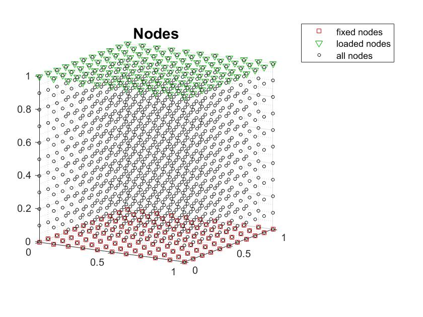
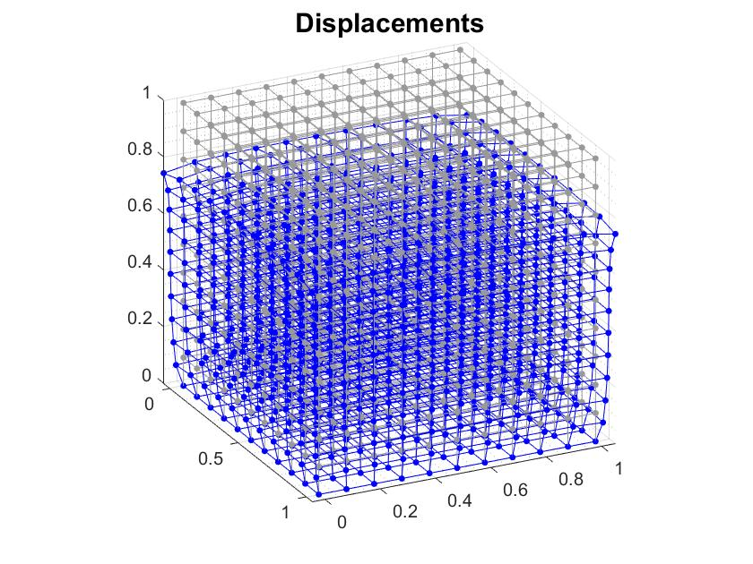

# 3D Continuum structure

## Description
* Performs a FEA 3D continuum structure analysis in Matlab 
when a solid block is subjected to a distributed force on the top surface.

## Usage
* Open and run the Continuum_Structure_3D.m file to see the plots.

## Author
* Jonas Chianu